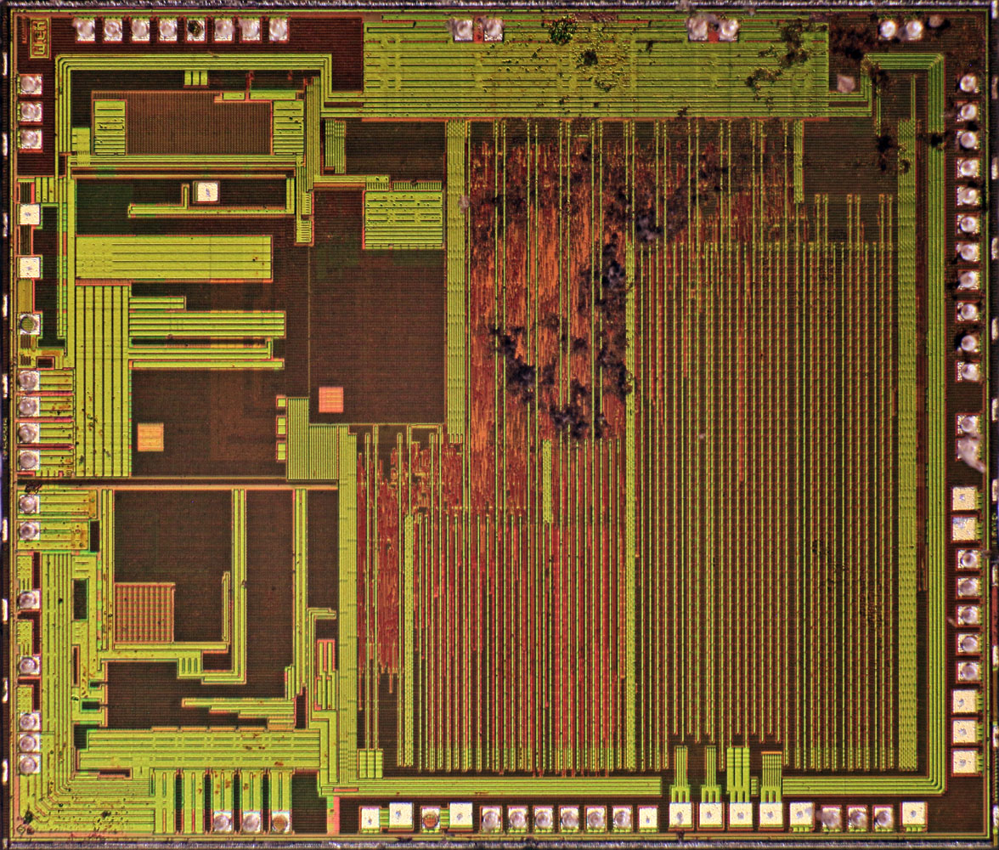

# mBusCH55x
An affordable USB-CDC TinyBasic dev board, **CH552E/CH554G/CH559T** compatible! 
 
  

As of 0801-2024, the list price on LCSC site:  
  

 

>Firmware supported:  
   cdcCMDs (CH55x)  
  
   TinyBasic cdc559-1000 (CH559)  
  

DIE inside: (CH55x, CH559)  
  
